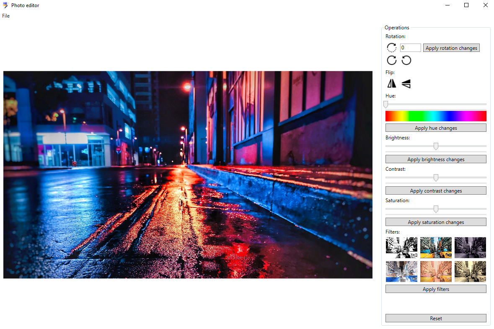

# Редактор изображений

### Задание
Разработать программы на базе библиотек [WinForms](https://docs.microsoft.com/en-us/dotnet/desktop/winforms/?view=netframeworkdesktop-4.8) и [WPF](https://docs.microsoft.com/en-us/dotnet/desktop/wpf/introduction-to-wpf?view=netframeworkdesktop-4.8), позволяющие просматривать и редактировать фотографии. Список команд: поворот на заданный угол; изменение цветности, яркости, контрастности; увеличение-сжатие; рисование кисточкой и др.

### Важные моменты
 - В приложениях для редактирования изображений используется библиотека [ImageProcessor](https://imageprocessor.org/).
 - В приложении реализованы следующие функции:
    1. Поворот изображения на заданный угол.
    2. Поворот изображения на 90 градусов вправо или влево.
    3. Отзеркаливание изображения по горизонтали или по вертикали.
    4. Изменение цветности изображения.
    5. Изменение яркости изображения.
    6. Изменение контрастности изображения.
    7. Изменение насыщенности изображения.
    8. Применение фильтров к изображению (поддерживается 6 фильтров).

### Скриншот приложения

  

